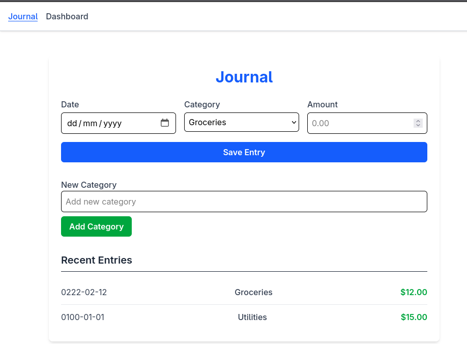
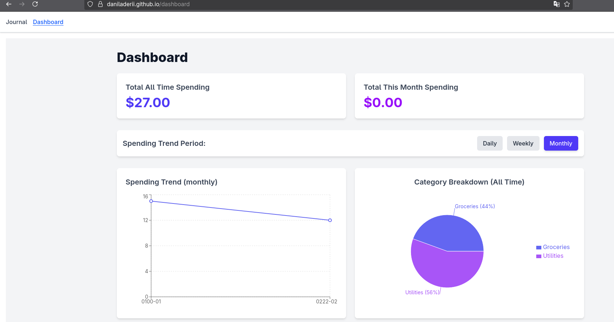

Spending Tracker

TeamMembers:
 
    6511753 KAUNG HTET Oo, 
    6630064 Siva Paoren, 
    6530154 Danila Derii

A tiny, local‑first spending tracker built with React + Vite.
You enter expenses in Journal, then see totals and charts in Dashboard. Data lives in the browser via localStorage.
Features

    Journal

        Add an entry with date, category, and amount

        Create new categories on the fly

        See a list of recent entries

    Dashboard

        Totals: all‑time and this month

        Trend line grouped by Daily / Weekly / Monthly

        Category breakdown (pie chart)

    Local persistence: everything is saved to localStorage
    (no backend, no accounts, no servers — just your browser)

Tech Stack

    React (Vite project)

    Recharts for charts

    Tailwind (via PostCSS) for styling (index.css imports)

    localStorage for persistence

    Vite builds to docs/ (good for GH Pages)

Usage

    Journal

        Pick a date, choose a category, enter amount, hit Save Entry

        To add a category: type a name under New Category → Add Category

    Dashboard

        See Total All Time and Total This Month

        Toggle Daily / Weekly / Monthly to change the trend grouping

        Check Category Breakdown to see where money goes

